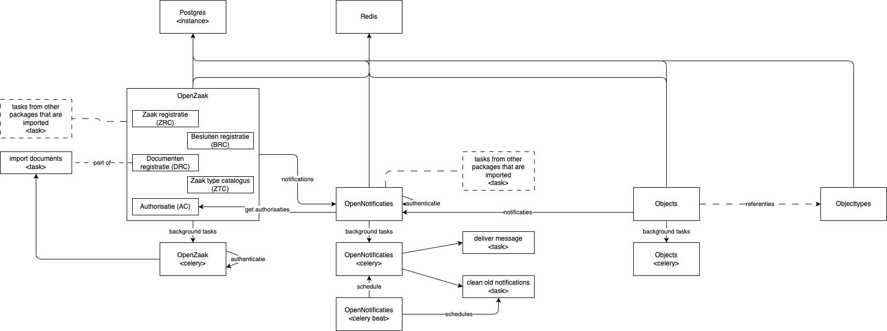

# Zaakgerichtwerken demo

Deze repo bevat een minimale demo omgeving met de maykin implementaties van de zaakgerichtwerken componenten.
Doel is om meer grip te krijgen op de APIs en de werking van het ecosysteem.

## Overzicht
Ik heb deze plaat in elkaar gezet om de verhoudingen tussen de componenten duidelijk te krijgen.
