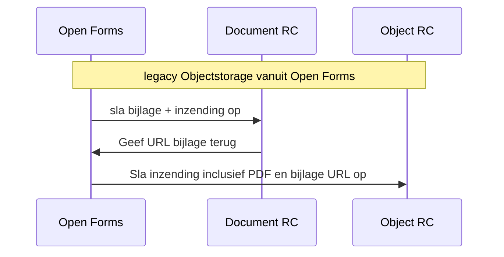
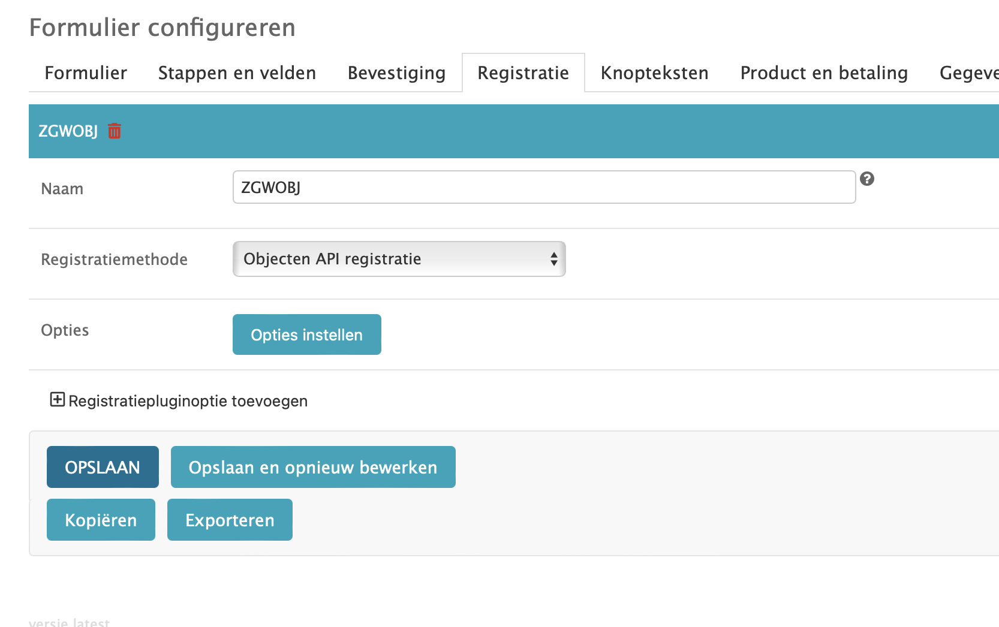
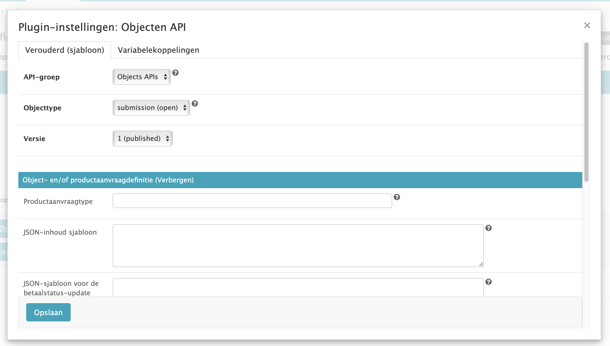
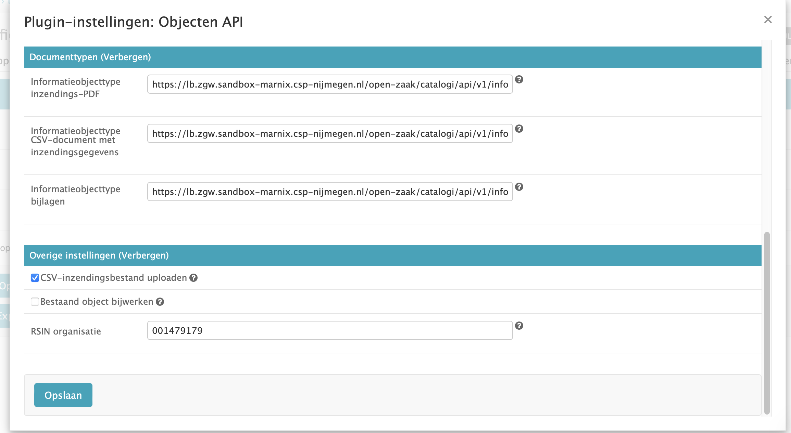

# Open Forms naar objects + documenten

In Open Forms met legacy-koppeling geconfigureerd. De route is als volgt:

De nieuwe koppeling lijkt veel meer handwerk te zijn. Vraag: Is de legacy objects API-koppeling in open forms echt legacy. De nieuwe variant lijkt heel veel handwerk per formulier (nieuw objecttype, alle variabelen met de hand koppelen) op te leveren. Kan dat handiger?

## In de interface
In Open Forms bij het formulier:

